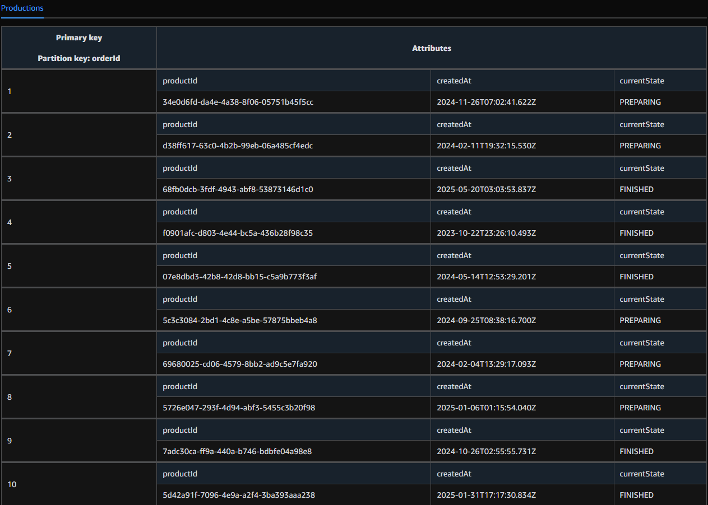
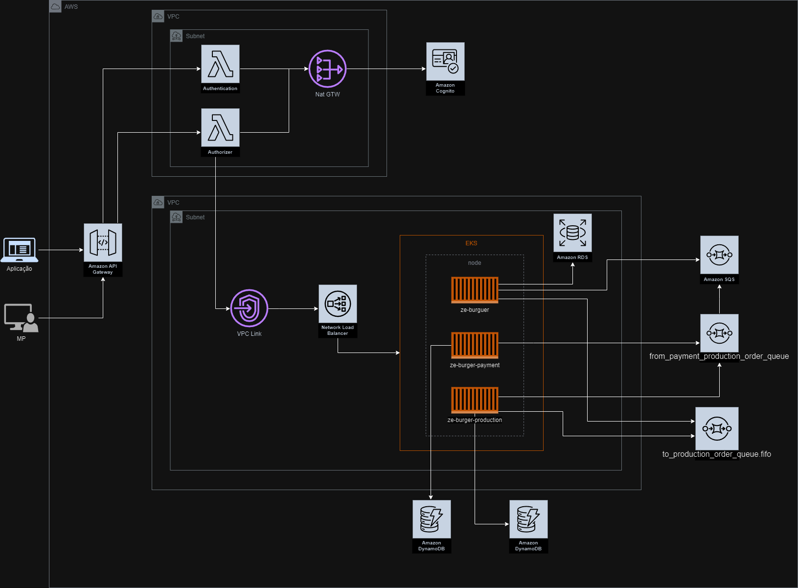
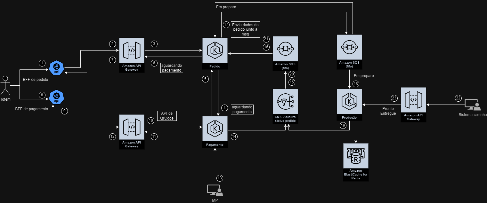
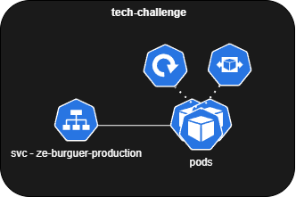

# Tech Challenge FIAP

Aplicação responsável pela gestão de pedidos da hamburgueria Zé do Burguer via totem de auto atendimento.

## Oficial Image

[Docker Image](https://hub.docker.com/repository/docker/marcosilva/ze_burguer/general)

## Documentação

[DDD](https://miro.com/app/board/uXjVMjkFsPU=/?share_link_id=958233804889)

[Arquitetura](#arquitetura)

[Arquitetura Cloud](#arquitetura-cloud)

[Stack](#stack-utilizada)

[Instalação Docker](#instalação-docker)

[Instalação Kubernetes](#instalação-kubernetes)

[APIs](#documentação-da-api)

---

## Arquitetura

### Clean Architecture


### Estrutura do projeto

- doc
- infra: Módulo responsável pela gestão da infra e configurações externas utilizadas na aplicação. Ex: Migrations, docker, config.go
- kustomize: Módulo responsável pela gestão dos arquivos kubernetes
- src
	- **External**: Módulo responsável por realizar a recepção dos dados e realizar a chamada para a controller
		- **Handler**: Camada responsável por definir o meio de recepção das requisições; ex: REST API, GraphQL, Mensageria
        - **Database**: Camada onde realizamos a configuração do banco de dados;
		- **Repository**: Camada responsável por realizar a integração com o banco de dados ; Ex: MySQL, PostgreSQL, DynamoDB, etc;
		- **Service**: Camada responsável por realizar a integração com serviços externos; Ex: Integração com mercado pago, integração com serviços AWS, etc;
    - **Controller**: Módulo responsável por realizar a validação dos dados e realizar a chamada para as UseCases necessárias
		- **Controller**: Camada responsável por realizar a validação dos dados e realizar a chamada para as UseCases necessárias;
		- **Serializer**: Camada responsável por definir o **Input** e **Output** da API;
    - **Application**: Módulo responsável pelo coração do negócio
        - **Modules**: Camada responsável pelos responses do **Service**; 
        - **Contract**: Camada responsável por definir as interfaces de **Service** e **Repository**;
        - **UseCases**: Camada responsável pela implementação da regra de negócio;
	- **Entities**: Módulo responsável pela definição das entidades da aplicação
        - **Entity**: Camada responsável pela definição das entidades que o sistema vai utilizar; Ex: Pedido, cliente
        - **Enum**: Camada responsável por definir os enums utilizados pelo negócio. Ex: Status do pedido, status do pagamento

--- 

## Database



Alguns pontos foram considerados para o uso do DynamoDB na nossa solução, dentre eles podemos destacar: escalabilidade, desempenho, serverless, alta disponibilidade

Dada a natureza da aplicação desenvolvida, levamos em consideração também a vantagem do NoSQL, em relação á performance na escrita.

Entre as opções de bancos NoSQL, escolhemos o DynamoDB devido a sua integração nativa com o ecossistema AWS. Isso nos proporciona:

Agilidade no Desenvolvimento: A integração com outros serviços AWS facilita a implementação e acelera o ciclo de desenvolvimento.

Flexibilidade de Schema: DynamoDB permite ajustes no schema das tabelas sem a necessidade de migrações complexas, adaptando-se facilmente às mudanças nos requisitos da aplicação.

---

## Arquitetura cloud





---

## Stack utilizada

**Linguagem:** Go (v1.22)

**Banco de dados:** PostgreSQL

**Ambiente:** Docker v24.0.5 | Docker-compose v2.20.2

**Kubernetes:** V1.27.2

---

## Instalação docker

Clone o projeto

```bash
  git clone https://github.com/ViniAlvesMartins/tech-challenge-fiap.git
```

Entre no diretório do projeto

```bash
  cd tech-challenge-fiap
```

Crie o arquivo `.env` apartir do `.env.example`

```bash
  cp .env.example .env
```

Inicie a aplicação

```bash
  docker-compose up
```
## Instalação kubernetes

Requisitos Cluster Kubernetes:

- Docker Kubernetes
- Metrics Server (Instalado)
	- [Guia de instalação Cluster](https://github.com/kubernetes-sigs/metrics-server?tab=readme-ov-file#installation)

Requisitos Criação dos Recursos:

- Kubectl 
	- [Guia de instalação local](https://kubernetes.io/docs/tasks/tools/)

Para criar os recursos 

```bash
  kubectl apply -k kustomize/
```

Com a execução acima será criado a seguinte infraestrutura:

Services
 - ze-burguer-production: NodePort 30443
 - postgres: NodePort 30432

Deployments
 - ze-burguer-production: HPA (2-5 Pods) - CPU Average Usage metrics
 - postgres: 1 Pod



## Documentação da API

[Collection_Postman](./doc/apis/Ze_burguer.postman_collection.json) (necessário importar as ENVS que costam na mesma pasta)

#### Base URL: http://localhost:8082

#### Doc Swagger: http://localhost:8082/docs/index.html

#### Passo a passo para execução das APIs

  - Categorias dos produtos:
    - | Id | Categoria  |
      | -- | ---------- |
      | 1  | Lanche     |
      | 2  | Bebida     |
      | 3  | Acompanhamento   |
      | 4  | Sobremesa  |

  - Status do pedido:
    - | Status | 
      | ------ | 
      | AWAITING_PAYMENT  | 
      | RECEIVED  | 
      | PREPARING  | 
      | READY  | 
      | FINISHED |

